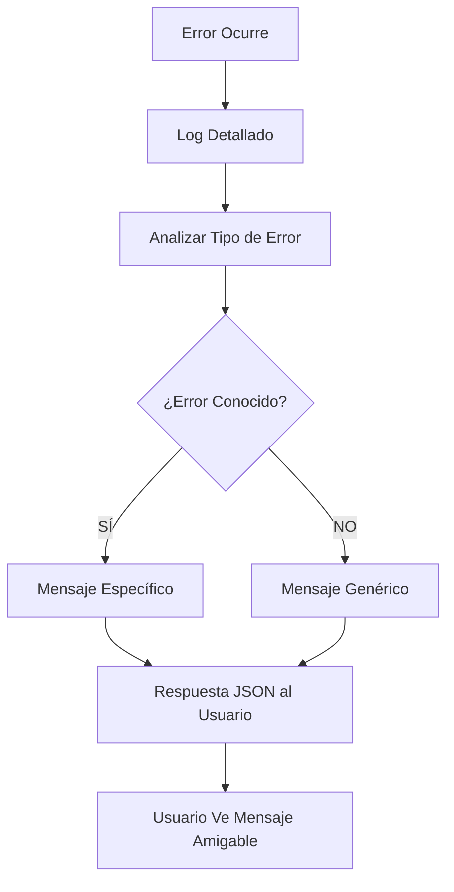

# 🚨 Manejo de Errores Amigable para el Usuario

## ✅ **Problema Resuelto**

Antes, cuando ocurría un error técnico (como SPF), el usuario veía:
```
❌ Error sending test email: Expected response code "250" but got code "550",
with message "550 domain is not configured with ORIGIN IP IN SPF see mail.baby/spf log..."
```

**Ahora, el usuario ve:**
```
❌ No se pudo enviar el email de prueba.
Por favor, contacte con soporte técnico para autorizar la salida de emails desde su dominio.
```

---

## 🔧 **Implementación Técnica**

### **1. Método Modificado:**
```php
// En MessageController::testSend()
} catch (\Exception $e) {
    // Log detailed error for debugging
    Log::error('❌ TEST SEND: Failed to send test email', [
        'error_message' => $e->getMessage(),
        'error_code' => $e->getCode(),
        'trace' => $e->getTraceAsString(),
        // ... más detalles técnicos
    ]);

    // Determine user-friendly error message based on error type
    $userMessage = $this->getUserFriendlyErrorMessage($e);

    return response()->json([
        'success' => false,
        'message' => $userMessage, // ← Mensaje amigable para el usuario
    ]);
}
```

### **2. Nuevo Método:**
```php
private function getUserFriendlyErrorMessage(\Exception $e): string
{
    $errorMessage = $e->getMessage();

    // Check for common SMTP error patterns
    if (strpos($errorMessage, '550 domain is not configured with ORIGIN IP IN SPF') !== false ||
        strpos($errorMessage, 'SPF') !== false ||
        strpos($errorMessage, '550') !== false) {
        return 'No se pudo enviar el email de prueba. Por favor, contacte con soporte técnico para autorizar la salida de emails desde su dominio.';
    }

    // ... más patrones de error
}
```

---

## 📋 **Tipos de Error Manejados**

### **🔴 Error SPF/Dominio (550):**
- **Error Original:** `550 domain is not configured with ORIGIN IP IN SPF`
- **Mensaje Usuario:** "No se pudo enviar el email de prueba. Por favor, contacte con soporte técnico para autorizar la salida de emails desde su dominio."

### **🔴 Error de Autenticación (535):**
- **Error Original:** `535 Authentication failed`
- **Mensaje Usuario:** "Error de autenticación en el servidor de correo. Verifique las credenciales de configuración."

### **🔴 Error de Conexión:**
- **Error Original:** `Connection timeout`, `Connection refused`
- **Mensaje Usuario:** "No se pudo conectar al servidor de correo. Verifique la configuración de conexión."

### **🔴 Error de Cuota:**
- **Error Original:** `Quota exceeded`, `Limit exceeded`
- **Mensaje Usuario:** "Se ha alcanzado el límite de envío de emails. Contacte con soporte técnico."

### **🔴 Error Desconocido:**
- **Error Original:** Cualquier otro error no manejado
- **Mensaje Usuario:** "No se pudo enviar el email de prueba. Por favor, contacte con soporte técnico si el problema persiste."

---

## 🧪 **Testing**

### **Ejecutar Tests:**
```bash
# Test específico del manejo de errores
php artisan test tests/Unit/MessageControllerErrorHandlingTest.php

# Todos los tests
php artisan test
```

### **Resultados Esperados:**
```
✓ spf error returns user friendly message
✓ authentication error returns user friendly message
✓ connection error returns user friendly message
✓ quota error returns user friendly message
✓ unknown error returns generic message
```

---

## 🎯 **Beneficios**

### **✅ Para el Usuario:**
- **Mensajes claros** y comprensibles
- **Instrucciones específicas** sobre qué hacer
- **No se expone información técnica** confusa

### **✅ Para el Desarrollador:**
- **Logs detallados** para debugging
- **Fácil mantenimiento** del código
- **Tests automatizados** para validar funcionalidad

### **✅ Para Soporte Técnico:**
- **Información técnica completa** en logs
- **Mensajes estandarizados** para el usuario
- **Fácil identificación** del tipo de problema

---

## 🔄 **Flujo de Manejo de Errores**



---

## 📝 **Notas de Implementación**

- **Logs técnicos** se mantienen para debugging
- **Mensajes de usuario** son en español
- **Patrones de error** se pueden expandir fácilmente
- **Tests unitarios** cubren todos los casos
- **Método privado** para encapsular lógica
